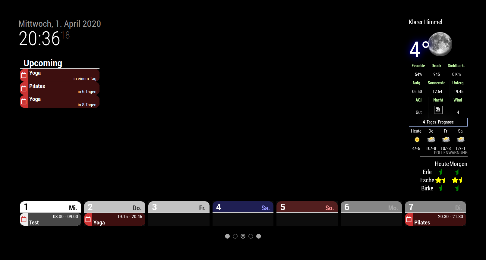
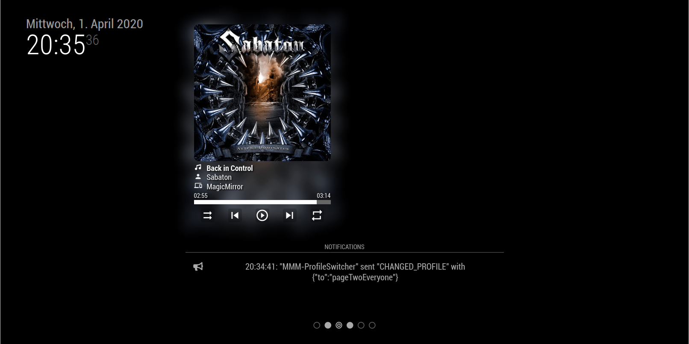

# MMM-ProfileControl

This module is based on the MMM-page-indicator [https://github.com/edward-shen/MMM-page-indicator] so first of all a big thanks to edward-shen.

The aim of this module is to provide a possibility to organize profiles into horizontal areas (like pages) and vertical ones (i.e. to set an profile within MMM-CalenderExt).
It is possible to set the current vertical index or horizontal index by notifications. Additionally you can only decrement or increment these values with notifications.

If you like the module displays an indicator of the pages and and/or an indicator of the current profile. The icons which are displayed can be overridden by configuration options (all free Font-Awesome icons are supported).

Additionally configureable notifications can be send each time a specific profile is selected.

This module is an add-on to MMM-ProfileSwitcher [https://github.com/tosti007/MMM-ProfileSwitcher]. Follow the README of the module and install it first.

## Screenshots





## Installation

```bash
    cd ~/MagicMirror/modules
    git clone https://github.com/Tom-Hirschberger/MMM-ProfileControl.git
    cd MMM-ProfileControl
    npm install
```

## Configuration

To use the module insert it in the config.js file. Here is an example:

```js
{
  module: 'MMM-ProfileControl',
  position: 'bottom_bar',
  config: {
    profiles: [
      ['pageOneEveryone', 'pageOneBirthdays'],
      ['pageTwoEveryone', 'pageTwoFamily', 'pageTwoLadies']
    ],

    horizontalActiveIcon: 'fa-eye',

    notifications: {
      'pageOneEveryone' : [
        {
          notification: 'HEY_THERE',
          payload: {
            nobody: 'will react'
          }
        },
        {
          notification: 'HEY_THERE2',
        }
      ]
    }
  }
},
```

The result of this example will be:

* Two pages
* The first one contains the profiles "pageOneEveryone" and "pageOneBirthdays"
* The second the profiles "pageTwoEveryone", "pageTwoFamily" and "pageTwoLadies"
* Each time the profile "pageOneEvery" is selected the notifications "HEY_THERE" and "HEY_THERE2" will be send.

**Attention: Do not use profiles twice in the configuration!!!**

| Option  | Description | Type | Default |
| ------- | --- | --- | --- |
| profiles | The profiles which should be switched | An array of arrays | [[]] |
| showHorizontalIndicator | If true an page indicator will be displayed | boolean | true |
| showVerticalIndicator | If true an profile on page indicator will be displayed | boolean | true |
| showSeparator | If true the separator icon will be added between horizontal and vertical indictor | boolean | true |
| startAgainAtHorizontalEnd | If true the pages start again at the start if the end is reached; If false the display will stay on the last page | boolean | true |
| startAgainAtVerticalEnd | If true the profiles will be rotated like the pages | boolean | true |
| notifications | An map containing arrays of notifications that will be send each time the profile with the given key is send | Map | {} |
| sendPresenceNotificationOnAction | Send a USER_PRESENCE notification (with payload true) if an profile change is triggered by this module | boolean | false |
| horizontalActiveIcon | The name of the icon class of the current active page | String | 'fa-circle' |
| horizontalInactiveIcon | The name of the icon class of the current inactive pages | String | 'fa-circle-thin' |
| verticalActiveIcon | The name of the icon class of the current active profile | String | 'fa-circle' |
| verticalInactiveIcon | The name of the icon class of the current inactive profiles | String | 'fa-circle-thin' |
| seperatorIcon | The name of the icon class of the separator of horizontal and vertical icons | String | 'fa-bullseye' |
| iconPrefix | The prefix of classes all icons get attached. Attention there needs to be a space character at the end | String | 'indicator fa ' |
| noChangeDuringScreensave | Do not change profiles during screensave; this is necessary for all persons using hide/show to realize screen blanking | boolean | false |
| hideDuringScreensave | Hide the profile indicators during screensave mode | boolean | false |

## Supported Notifications

| Notification | Payload | Description |
| ------------ | ------- | ----------- |
| PROFILE_SET_HORIZONTAL | The horizontal index | The number of the page to select (starting with 0) |
| PROFILE_SET_VERTICAL | The vertical index | The number of the profile on the current page to select (starting with 0) |
| PROFILE_INCREMENT_VERTICAL | nothing | Increment the profile number by one; if the end is already reached it will stay on this profile (or if configured start at 0) |
| PROFILE_DECREMENT_VERTICAL | nothing | Decrement the profile number by one; if the beginning is already reached it will stay on this profile (or if configured start at the end) |
| PROFILE_INCREMENT_HORIZONTAL | nothing | Increment the page number by one; if the end is already reached it will stay on this page (or if configured start at 0) |
| PROFILE_DECREMENT_HORIZONTAL | nothing | Decrement the page number by one; if the beginning is already reached it will stay on this page (or if oconfigured start at the end) |
| CHANGED_PROFILE | from and to | this notification is send by MMM-ProfileSwitcher if the profile is changed; you can change the profile with any other module, too. Use the CURRENT_PROFILE notification as described in the documenation of MMM-ProfileSwitcher for this. The module then sends this CHANGED_PROFILE notifcation and we update the indicator |
| SCREENSAVE_ENABLED | nothing | This notification is send of the MMM-Screen-Powersave-Notification module if screensave mode is enabled |
| SCREENSAVE_DISABLED | nothing | This notification is send of the MMM-Screen-Powersave-Notification module if screensave mode is disabled |
